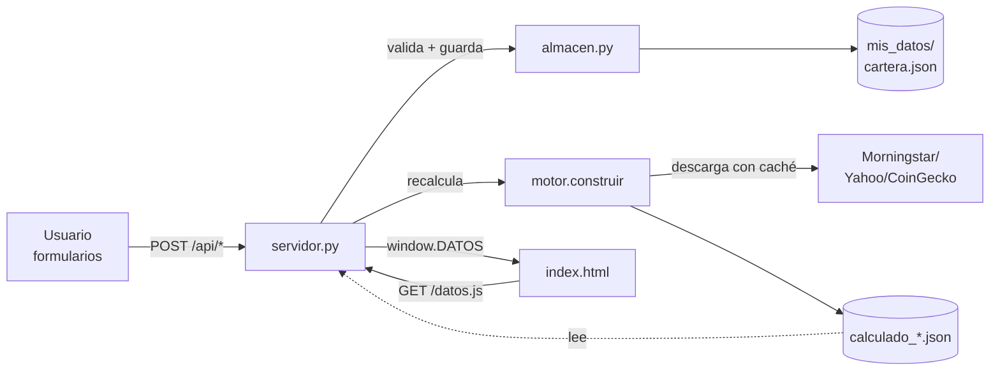

# Arquitectura de la aplicación

> Documento vivo. Describe la arquitectura de la app **Rumbo** en su estado actual
> (base v1.1.0, fork `AlonsoVine/rumboExito`) y sirve de referencia para el desarrollo
> del **Gestor Patrimonial** (superconjunto del Excel). Ver también
> [ROADMAP.md](ROADMAP.md) y los [ADR](adr/).

## 1. Visión general

Aplicación **100 % local** para gestionar el patrimonio neto de una persona o un hogar.
No hay cuentas de usuario, ni servidores remotos, ni base de datos: todo vive en el
ordenador del usuario. La app solo sale a internet para **descargar precios** de
servicios públicos (Morningstar, Yahoo Finance, CoinGecko) y para comprobar si hay una
versión nueva en GitHub; en esas consultas no viaja ningún dato del usuario.

- **Lenguaje / framework:** Python 3.10+ · Flask.
- **Sin BD:** los datos se guardan en un único fichero JSON (`mis_datos/cartera.json`).
- **Sin Node / sin build:** el panel es HTML + CSS + JavaScript sin librerías externas;
  los gráficos son SVG propios.
- **Servidor:** escucha **solo** en `127.0.0.1` (por defecto puerto `8765`), de modo que
  nadie de la red local puede acceder.

## 2. Estructura de carpetas

```
rumboExito/
├── Iniciar.bat / Iniciar.command   Lanzadores de doble clic (texto plano)
├── pyproject.toml / requirements.txt / uv.lock
├── app/
│   ├── __main__.py      Punto de entrada (python -m app)
│   ├── servidor.py      Servidor Flask local: rutas /api/*, orquestación
│   ├── motor.py         El cerebro: precios, series diarias, TIR, TWR, comparador
│   ├── buscar.py        Buscador de productos (ISIN / ticker / nombre)
│   ├── importar.py      Importadores (MyInvestor, plantilla, texto de IA)
│   ├── almacen.py       Validación, guardado atómico y copias de seguridad
│   ├── exportar.py      Exportación del panel a una web estática
│   ├── plantilla.py     Genera la plantilla .xlsx / .csv de importación
│   ├── prompt_ia.txt    Prompt para convertir extractos con una IA
│   └── web/             Front (index.html, app.js, graficos.js, editor.js, canal.js)
├── demo/cartera.json    Cartera de ejemplo
├── docs/                Documentación (este directorio)
└── mis_datos/           DATOS DEL USUARIO (se crea al usarla; nunca se sube)
    ├── cartera.json         La cartera del usuario
    ├── calculado_*.json     Resultado del último cálculo (propio/demo)
    ├── estado.json          Metadatos (última actualización de precios)
    ├── historico.json       Un resumen por cada fecha calculada
    ├── cache/               Series de precios descargadas
    └── copias/              Copias de seguridad automáticas (20 últimas)
```

## 3. Módulos y responsabilidades

| Módulo | Responsabilidad |
|---|---|
| **`servidor.py`** | Servidor Flask. Expone las rutas `/api/*`, sirve el panel estático y orquesta el recálculo. Un `RLock` global garantiza que no haya dos cálculos ni dos escrituras a la vez. Escritura atómica (fichero temporal + `os.replace`). |
| **`motor.py`** | **El cerebro.** Descarga precios (con caché en disco), construye las series diarias por producto y agregadas, y calcula todo lo que pinta el panel: aportado, plusvalía, **TIR** (XIRR), rentabilidad **TWR** encadenada, rentabilidad por año, comisiones, comparador «¿y si lo hubieras indexado?», hitos, racha, máxima caída… Devuelve el diccionario `DATOS`. |
| **`buscar.py`** | Buscador por ISIN, ticker o nombre contra Morningstar, Yahoo y CoinGecko. Comprueba que el producto tiene precio antes de guardarlo y autorrellena TER, riesgo y categoría. |
| **`importar.py`** | Importadores: CSV de MyInvestor, plantilla de Excel/CSV y texto pegado de una IA. Genera una **vista previa** antes de confirmar. |
| **`almacen.py`** | Validación de productos, movimientos y valoraciones; guardado con **copia de seguridad automática** previa (máx. 20) y escritura atómica. Define la cartera vacía y las reglas de negocio de entrada. |
| **`exportar.py`** | Genera el panel como una única página HTML estática de solo lectura (con opción de **ocultar importes**). |
| **`plantilla.py`** | Genera la plantilla de importación en `.xlsx` (con desplegables, hoja de ejemplo e instrucciones) y `.csv`. |

## 4. Flujo de cálculo

El navegador **nunca** calcula el patrimonio: todo el cálculo es determinista y ocurre
en el servidor. El front solo pinta el resultado.



1. El usuario crea/edita productos, movimientos o valoraciones mediante formularios.
2. `servidor.py` valida y guarda con `almacen.py` (copia de seguridad + escritura atómica).
3. `servidor.py` llama a `motor.construir(cartera, DATOS, descargar=…)`, que descarga los
   precios que falten (o todos), construye las series diarias y escribe `calculado_<modo>.json`.
4. El front carga `/datos.js`, que expone el resultado como `window.DATOS`, y lo pinta.

Modos de `descargar`: `True` (baja todo), `"faltan"` (solo lo que no está en caché),
`False` (recalcula sin red, con lo guardado). Al arrancar, si los precios tienen más de
6 horas, se actualizan.

## 5. Modelo de datos actual (`cartera.json`)

Estructura de la cartera **antes** del rediseño (ver
[ADR 0002](adr/0002-modelo-de-datos-unificado.md) para el modelo unificado):

- **`productos`**: fondos, ETF, acciones, cripto, materias primas, bonos, planes de
  pensiones, cuentas/efectivo, inmuebles, deuda, otros. Campos: `id`, `nombre`, `corto`,
  `tipo`, `fuente` (`morningstar`/`yahoo`/`coingecko`/`manual`), `codigo`, `moneda`,
  `entidad`, `ter`, `riesgo`, `largoPlazo`, `slot` (color), etc.
- **`movimientos`**: `compra`, `venta`, `dividendo`, `comision`. Campos: `fecha`,
  `producto`, `tipo`, `unidades`, `importe`, `comision`, `nota`. Las ventas descuentan
  coste por **FIFO**.
- **`valoraciones`**: saldos/valores anotados a mano (para cuentas, pensiones, inmuebles…).
  Campos: `fecha`, `producto`, `valor`, `aportado`.
- **`comparador`**: carteras de referencia para la comparación indexada.
- **`hitos`**: importes objetivo para marcar en la curva de patrimonio.
- **`objetivo`**: meta de importe única.
- **`titular`**: nombre del titular (hoy, un único valor global).

## 6. Interfaz de usuario

El panel es una SPA ligera con **6 pestañas** (`app/web/index.html`):

| Pestaña | Contenido |
|---|---|
| **Patrimonio** | Foto del patrimonio, distribución, hitos, objetivo, tabla de movimientos. |
| **El mes** | Resumen mes a mes. |
| **Productos** | Ficha de cada producto (precio, unidades, ventanas de rentabilidad). |
| **Rendimiento** | Rentabilidad por año, comparador indexado, comisiones. |
| **Mis datos** | Alta/edición de productos, movimientos y saldos; importar; copias y web. |
| **Ayuda** | Preguntas frecuentes. |

Atajos: `V` (modo vídeo), `1`–`6` (cambiar de pestaña), botón de tema claro/oscuro.

## 7. Cómo se ejecuta

Con **uv** (recomendado por el proyecto original):

```bash
uv run python -m app
```

Con un **entorno virtual** del proyecto (usado en este equipo, que no tiene uv):

```bash
# Crear e instalar (una vez)
python -m venv .venv
.venv/Scripts/python.exe -m pip install flask openpyxl        # Windows
# .venv/bin/python -m pip install flask openpyxl              # Mac/Linux

# Arrancar
.venv/Scripts/python.exe -m app                               # Windows
# .venv/bin/python -m app                                     # Mac/Linux
```

La app abre el navegador en `http://127.0.0.1:8765/`. Variables de entorno útiles:

- `PATRIMONIO_DATOS`: carpeta de datos alternativa (pruebas/capturas).
- `PATRIMONIO_PUERTO`: puerto (por defecto 8765).
- `PATRIMONIO_NO_ABRIR`: si está definida, no abre el navegador (útil en pruebas).

Ver [DESARROLLO.md](DESARROLLO.md) para el flujo completo de desarrollo, tests y linter.
